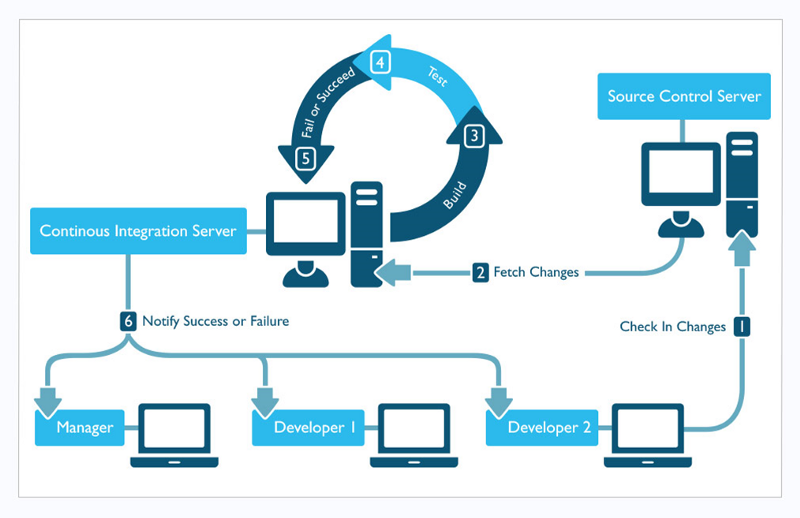

## DevOps is a partnership between development and operations teams that streamlines the software development process. The process has several significant stages:

**Continuous Integration (CI):**

Developers frequently merge their code changes into a shared repository, where automated tests assure high-quality code. This method reduces delays by allowing different developers to work on the same code at the same time.

**Continuous Delivery (CD):**

Code changes are automatically built, tested, and ready for production deployment.
The goal is to provide users with updates rapidly and cost-effectively.

**Continuous Deployment (CD):**

Continuous deployment in advanced DevOps automates the release process even further, eliminating the need for manual intervention. Every authorized update is automatically released to users, removing the need for fixed release dates.

**Constant Monitoring and Feedback:**

Throughout the development cycle, automated monitoring gives ongoing feedback on products and systems. This guarantees that errors are quickly identified, allowing for rapid solutions and maintaining system reliability.

## This simplified approach prioritises collaboration, automation, and continuous feedback, allowing teams to develop high-quality software more effectively.

