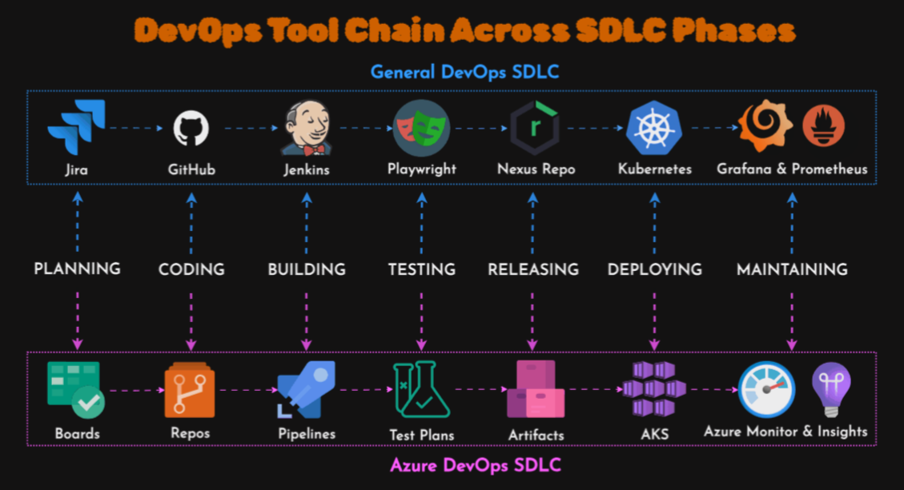

**********************************************************************
*
*     ISDEVOP S12
*     ISDEVOP Midterm Exam - Question 1
*
*     Author: Thea Verah Sumagang
*     Date: March 6, 2024
*
**********************************************************************

An effective DevOps workflow typically begins with version control, 
where developers collaborate on code changes using platforms like Git. Continuous Integration (CI) 
comes next, where automated builds and tests are triggered whenever new code is pushed to the repository. 
This ensures early detection of issues and maintains code quality. Then, Continuous Deployment (CD) 
automates the release process, pushing changes to production environments after passing through 
various stages such as testing and staging.

To support this workflow, a comprehensive set of tools is essential. For project management, a platform like Notion 
help teams organize tasks and track progress. Git serves as the version control system for managing code changes. 
Jenkins is utilized as the continuous integration server to automate the build process. For testing, 
teams rely on automated testing frameworks like Selenium and containerization tools such as Docker 
for efficient and reliable testing environments. By integrating these tools into a cohesive toolchain, 
organizations can streamline their DevOps practices and deliver software more efficiently.

