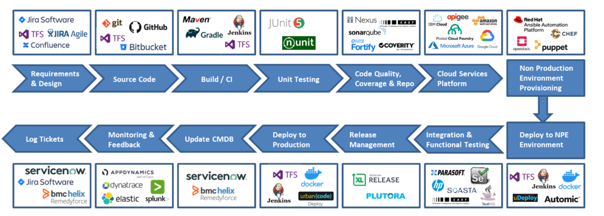

## Project Management
- To have an effective DevOps workflow, there should be a proper project management at the start. This ensures information are transparency across different departments or teams
### Tools:
- Jira
- Trello
- Asana

## Continuous Integration
- Coding is the most important part of a development process. With this, proper coding and building tools should be used to manage the quality of the code.
- This also include the automated testing of the code to ensure the quality and validity of the code. Version control tools are also used to manage the different version of the codes.
- Developer are assigned with tasks and use the tools to commit their codes to the repository.
### Tools: 
- Gitlab
- Jenkin
- Selenium

## Continuous Delivery / Continuous Deployment
- Continuous Delivery ensures that all codes pass the automated unit testing, integration testing, system testing and other testing. At this stage, it ensures that all codes is ready to push to the production environment. However, the pushing of the new version of software to the production environment is still done <b>manually</b>. 
- QA may be the person that is responsible to push the code to the production environment since it is the person that do the final checking.
- Continuous Deployment practice ensures that the code is <b>automatically</b> push to the production environment after passing the testing.
- This process is automated by using different tools.
### Tools:
- Docker

## Monitoring and Management
- This stage continue monitor the system usage, logs and user behavior. 
- This ensures the teams can quickly respond to the problem when issues happened.
- Logs can help the developer to allocate the problem
### Tools:
- Prometheus
- ELK Stack
- Grafana

## Feedback
- The last stage of the workflow is to collect the feedback from the users. 
- This allows the users to report the problem they met and allows the team to resolve it.
### Tools:
- Email
- Google Chat

#Image of DevOps Lifecycle
