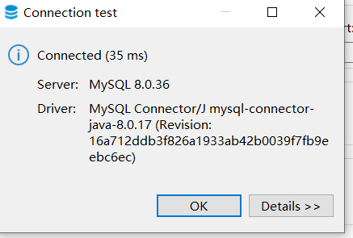

```dockerfile
FROM centos:7

# Not sure why, but I think the version needs to be el7-* and 11 is the latest one
RUN yum -y install https://dev.mysql.com/get/mysql80-community-release-el7-11.noarch.rpm
RUN yum -y install mysql-community-server

RUN mysqld --initialize-insecure

# The username and password is root, root
CMD ["bash", "-c", "\
    mysqld --user=root --daemonize \
    && sleep 5 \
    && mysql -u root -e \"CREATE USER 'root'@'gateway' IDENTIFIED BY 'root';\" \
    && mysql -u root -e \"GRANT ALL PRIVILEGES ON *.* TO 'root'@'gateway';\" \
    && mysql -u root -e \"ALTER USER 'root'@'gateway' IDENTIFIED BY 'root';\" \
    && tail -f /dev/null \
"]

EXPOSE 3306
```
Proof of connection:


