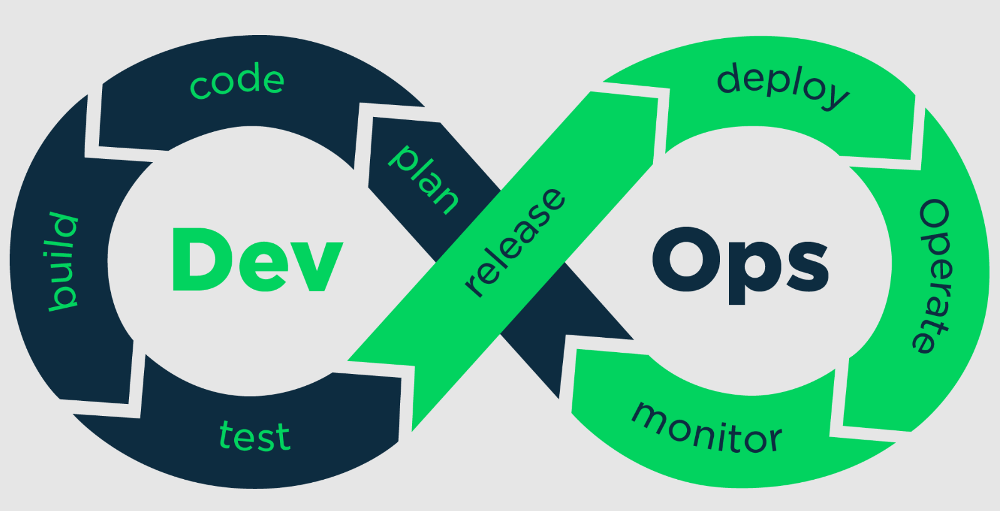

## Effective DevOps Workflow and Toolchain
 

**Here's a typical DevOps workflow:**

1. **Development Phase:** Writing of code to build a testable product. Also involves planning. 
2. **Build and Integration Phase:** Building of code in order to get ready for testing.
3. **Testing and Deployment Phase:** After building and Integration, developers needs to run tests for it in order to ensure that it is ready for deployment. After that, they can deploy it manually or use tools for automatic deployment.
4. **Monitoring and Feedback Phase:** After it is deployed, it is recommended to monitor and acquire feedback in order to improve the product.

**Effective DevOps:**
DevOps can help in improving collaboration between developers and it also allows for faster software updates to the system. DevOps also allows for automating parts of the process involved in the development. It will make it more efficient and also allow for improvement in quality. 
