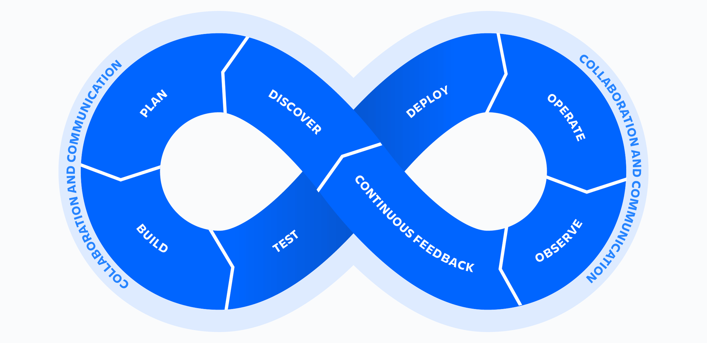

# DevOps Workflow and Toolchain

1. Planning
Tools: Trello

2. Code
Tools: Git, Github

3. Build
Tools: Jenkins

4. Test
Tools: SonarQube

5. Release
Tools: JFrog Artifactory

6. Deploy
Tools: Kubernetes, Ansible, Terraform

7. Operate
Tools: Prometheus, Grafana, Graphite, Netdata

8. Monitor and Feedback
Tools: New Relic, Datadog