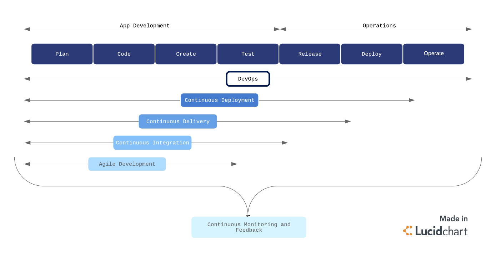
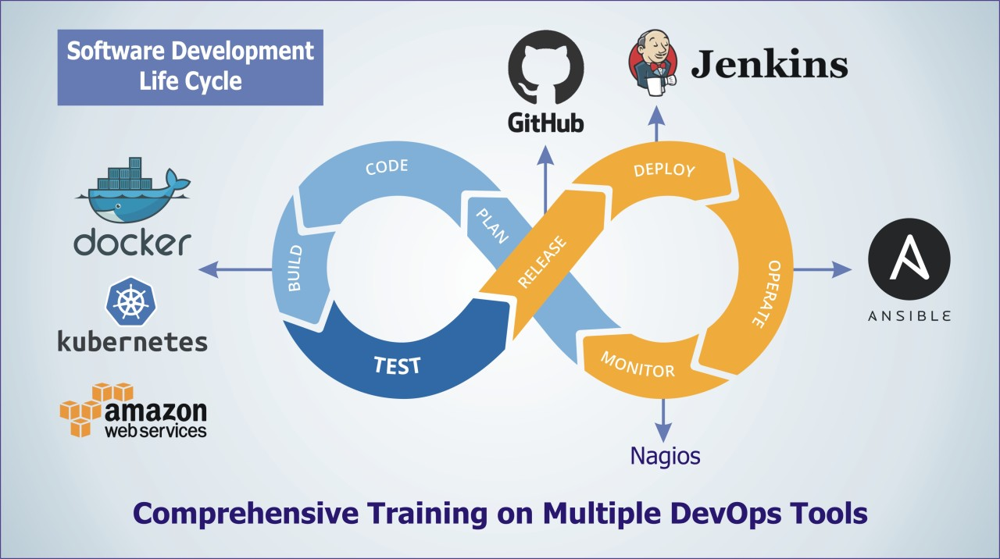

---
-
- ISDEVOP S17
- Midterms Question 1
-
- Author: Elliamae Ang
- Date: March 1, 2024
-
---

## In your own words, kindly illustrate an effective DevOps workflow and toolchain

The goal of DevOps is to merge the development team and QA testers with IT operations. As such, the development lifecycle in DevOps encompasses all processes or phases that all teams undergo. For app development, the phases are **planning, coding, creating, and testing**. For operations, the phases are **releasing, deploying, and operating**.

For quick turnaround, DevOps enhances collaboration through automations in the lifecycle. These automations include **continuous integration, continuous testing, continuous monitoring and feedback, continuous delivery, and continuous deployment**.

- **Continuous integration**
  - This principle enforces that developers should always push any changes they have made to the code to the shared repository as often as possible.
- **Continuous testing**
  - This process ensures that the code is functioning as intended for a live environment.
- **Continuous monitoring and feedback**
  - This process that persists throughout the entire lifecycle ensures that the system is able to remain reliable through consistent monitoring and continuous feedback, which operations should be able to communicate to developers immediately.
- **Continuous delivery**
  - This principle enforces that the code must be ready for deployment to the stage and/or production environment at any given time.
- **Continuous deployment**
  - This principle enforces that changes or updates made to the code will be deployed in production automatically, making it accessible to the users instantaneously.

With regards to the DevOps toolchain, popular tools used include **Git, Jenkins, and Docker**.

- **Git**
  - Version control system that facilitates collaboration and helps with continuous integration and continuous delivery.
- **Jenkins**
  - Automation server that provides automation for build, test, and deployment and helps with continuous integration and continuous testing.
- **Docker**
  - Platform for containerization that allows for ensuring uniformity of deployments across different environments and helps with continuous delivery and continuous deployment.

In application, these three tools would work together to speed up deployment. For instance, when developers are done with their code, they commit this to **Git**. **Jenkins** is able to detect the commit, and will automatically be triggered to build and test. When the code passes the tests, a **Docker** image is automatically made. This image, when it passes its own tests, will then be automatically deployed to the desired environment.

