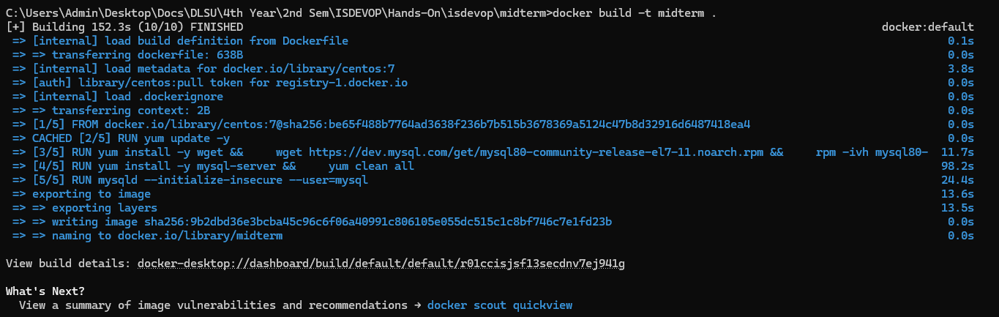
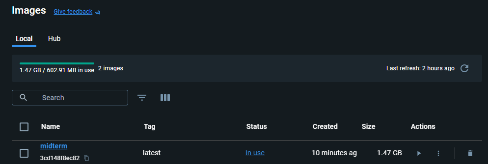

---
-
- ISDEVOP S17
- Midterms Question 2
-
- Author: Elliamae Ang
- Date: March 1, 2024
-
---

## Create a dockerfile that creates a CentOS 7 virtual machine and installs a BASIC MySQL database. Basic means no additional configuration file, and I will only be needing the sa user.

### Dockerfile code:

_(See Dockerfile)_

```
FROM centos:7

ENV MYSQL_ROOT_PASSWORD=rootpass123
ENV MYSQL_USER=sa
ENV MYSQL_PASSWORD=sapass123

RUN yum update -y

RUN yum install -y wget && \
    wget https://dev.mysql.com/get/mysql80-community-release-el7-11.noarch.rpm && \
    rpm -ivh mysql80-community-release-el7-11.noarch.rpm

RUN yum install -y mysql-server && \
    yum clean all

RUN mysqld --initialize-insecure --user=mysql

CMD ["mysqld"]

EXPOSE 3306
```

Reference: https://phoenixnap.com/kb/how-to-install-mysql-on-centos-7

### Building the image:



### Verifying that the image exists:


