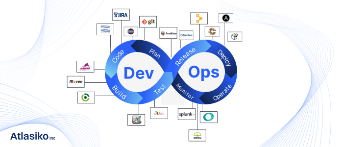

**********************************************************************
*
*     ISDEVOP
*     ISDEVOP Midterm Question 1
*     Objective: Gain Understanding of the DevOps Workflow
*     
*     Author: Miguel Perez
*     Date: March 3, 2024
*     
**********************************************************************

# Question 01: In your own words, kindly illustrate an effective DevOps workflow and toolchain. You may add images in your markdown file. To do that, the syntax is 

## Answer:
An effective DevOps workflow typically involves developers and operations teams working closely
together to automate and streamline the software development lifecycle. This includes using version
control systems like Git for code management, continuous integration tools like Jenkins for automating
builds, and automated testing frameworks like Selenium for testing. Deployment can be automated using
tools like Docker for containerization and Kubernetes for orchestration, ensuring consistent and
reliable deployment across different environments. Continuous monitoring and feedback loops are also
essential, with tools like Prometheus and Grafana used for monitoring and reporting.

