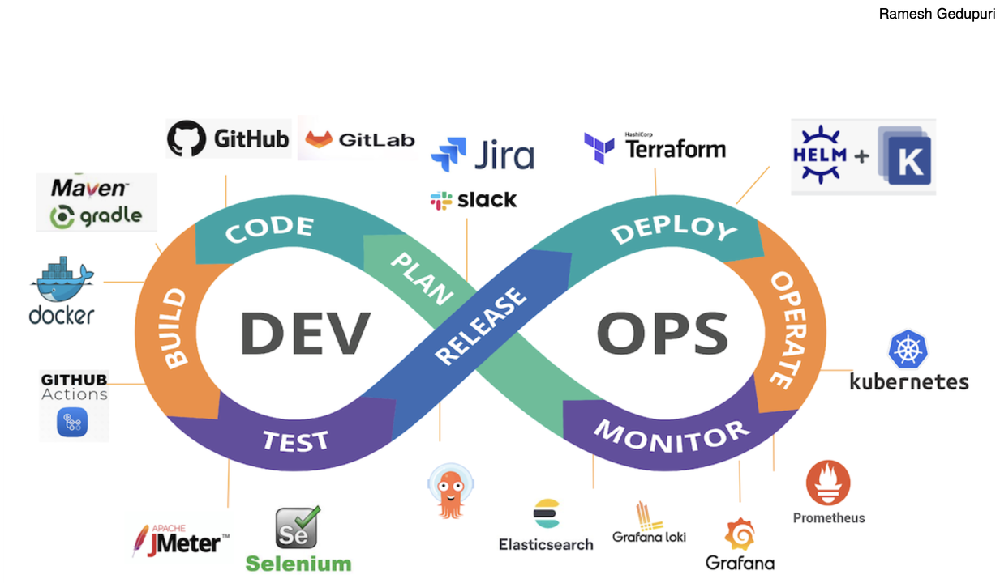

**********************************************************************
*
*     ISDEVOP
*     ISDEVOP Midterm Exam
*     Objective: Question 1
*     
*     Author: Jerrick Ezekiel Santos
*     Date: March 3, 2024
*     
**********************************************************************

# DevOps workflow and toolchain

DevOps is like a restaurant kitchen where chefs (developers) and servers (operations) work together seamlessly. They use a recipe book (version control) to create and modify dishes (code), an assembly line (continuous integration) to ensure consistency, and a tasting room (automated testing) to guarantee quality. With clear communication, efficient processes, and constant improvement, they deliver delicious meals (software) to satisfied customers (users) in a timely manner.

| Step    | Description |
| -------- | ------- |
| Code  |  Chefs (developers) create or modify recipes (code) using the recipe book (version control system) to track changes |
| Build |  Ingredients (code changes) are prepared into dishes (applications) in the kitchen (continuous integration), ensuring they are combined correctly and ready for testing or taste testing  |
| Test    |  Dishes (applications) are taste-tested in the tasting room (automated testing) to ensure they are free of bugs or defects before being served to customers |
| Release    | Approved dishes (tested code) are automatically delivered to the dining room (production environment)  |
| Operate    | Chefs (operations) manage the kitchen equipment (infrastructure), ensuring that everything runs smoothly and efficiently during service
   |
| Monitor    | Quality control chefs (monitoring tools) keep an eye on the dishes (applications) in the dining room (production environment), tracking how they are being received by customers and alerting chefs if something goes wrong

    |