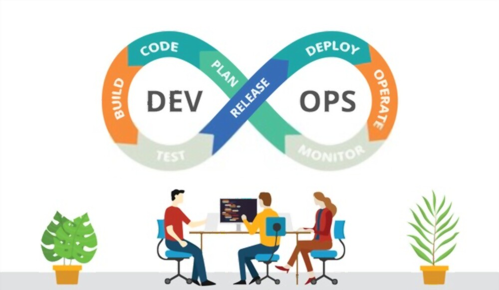

## Integrating development and operations teams to optimize the software delivery pipeline from code development to deployment and monitoring is a key component of an efficient DevOps workflow. An efficient DevOps workflow and toolchain may be seen in this example:

**1. Planning and Collaboration**: Using project management systems like Trello, development and operations teams work together to establish project requirements, prioritize activities, and schedule releases.

**2. Version Control**: Version control systems, such as Git, are used by developers to monitor and manage codebase changes. To work on new features or issue fixes, they make feature branches.

**3. Continuous Integration (CI) and Continuous Delivery (CD)**: CI involves developers pushing code changes, triggering automated builds and tests to ensure code quality. CD extends this by automatically deploying code to staging, utilizing tools like Docker for consistent deployments.

**4. Automated Testing and Deployment**: Code changes are validated by automated testing tools, which guarantee both functionality and quality. Code is sent to production using deployment automation technologies. Application performance is tracked by real-time monitoring, while teams collect metrics and feedback to promote ongoing development.